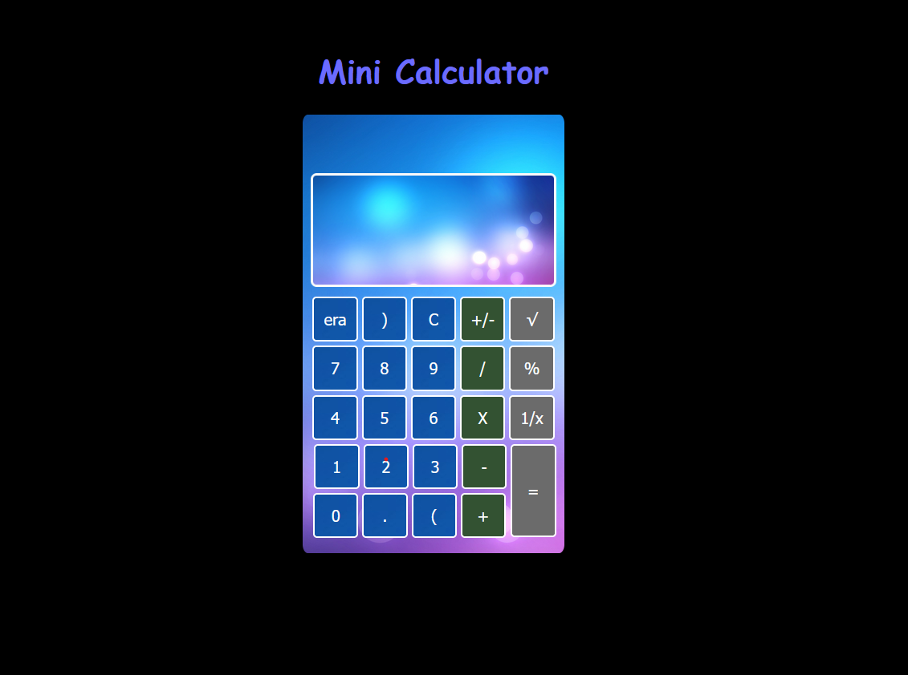
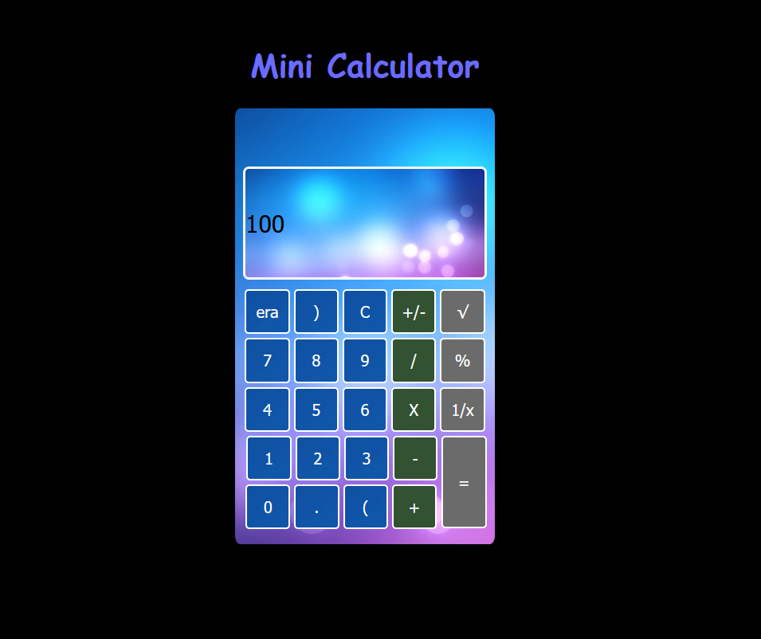

# Mini Calculator Project

Welcome to the Mini Calculator project! This simple calculator can perform basic arithmetic operations and is designed for educational purposes.

## Table of Contents

- [Features](#features)
- [Screenshots](#demo)
- [Getting Started](#getting-started)
- [Usage](#usage)

## Features

- Addition(+)
- Subtraction(-)
- Multiplication(X)
- Division(/)
- Modulus(%)
- Square root(√)
- Reciprocal(1/x)
- Change of Sign(+/-)
- Clearing the input(C)
- Erasing(era)

## Screenshots




## Getting Started

Follow these instructions to get a copy of the project up and running on your local machine.

1. **Clone the repository**

   ```bash
   git clone https://github.com/DhanushNehru/Ultimate-Web-Development-Resources.git
   ```

2. **Open index.html in your preferred browser**

   Simply open the `calc.html` file in your web browser.

## Usage

Here's how to use the Mini Calculator:

- Clicking on respective buttons provided does respective operations....
- Whole input is visible by scrolling the input-search
- For undefined functions it shows (NaN)


