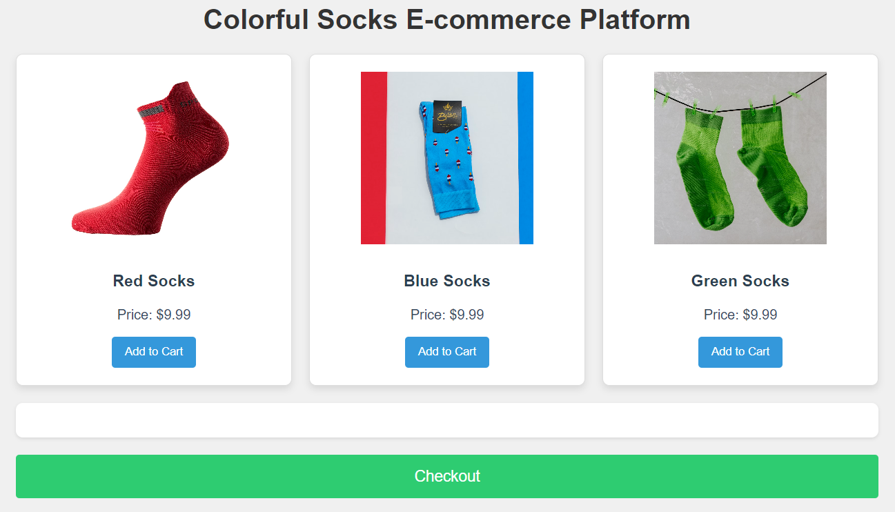

# Colorful Socks E-commerce Platform

This is a simple e-commerce platform built using **Vanilla JavaScript**, **HTML**, and **CSS**, featuring a collection of colorful socks. The platform allows users to view available socks, add them to a cart, and proceed to checkout. It showcases a clean layout with a grid system and modern styling.

## Table of Contents
- [Features](#features)
- [Technologies Used](#technologies-used)
- [Installation](#installation)
- [Usage](#usage)
- [Folder Structure](#folder-structure)

## Features
- **Product Display**: View colorful socks in a responsive grid format.
- **Add to Cart**: Select socks to add to the shopping cart.
- **Cart Management**: See items in the cart and calculate the total price.
- **Checkout**: Proceed to checkout, displaying a purchase confirmation.
- **Responsive Design**: Adjusts to different screen sizes.

## Technologies Used
- **HTML5**
- **CSS3** (Grid layout, Shadows, Responsive Design)
- **Vanilla JavaScript**

## Installation

1. Clone the repository:
    ```bash
    git clone https://github.com/DhanushNehru/Ultimate-Web-Development-Resources.git
    ```
2. Navigate to the project directory:
    ```bash
    cd E-commerce
    ```

3. Ensure the `index.html`, `styles.css`, and `images` folder are in the same directory.

## Usage

1. Open `index.html` in your browser to launch the e-commerce platform.

Here is a screenshot of the homepage:



2. Browse the available socks, and click **Add to Cart** to include them in your shopping cart.

Here is a screenshot of the cart:


3. Click **Checkout** to simulate a purchase.

Here is a screenshot of the checkout functionality:


## Folder Structure

```bash
.
├── images/                  # Contains product images
│   ├── red-socks.jpg
│   ├── blue-socks.jpg
│   └── green-socks.jpg
├── socks-ecommerce-platform.html  # Main HTML file
├── socks-ecommerce-styles.css     # Main CSS file
└── README.md                # Project documentation
```

## Feel Free to Connect with Me

You can find me on GitHub: [Areeb Niyas](https://github.com/areebniyas)

