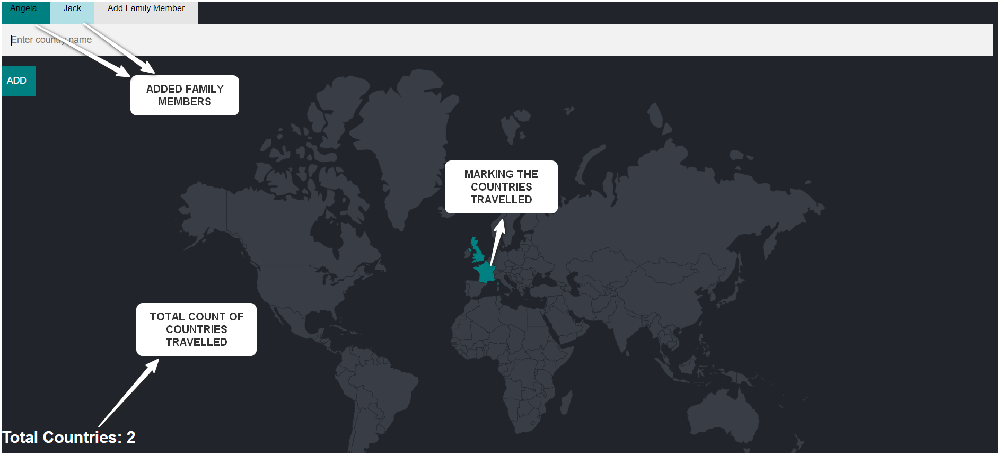

# Family Travel Tracker

## Overview

The **Family Travel Tracker** is an interactive web-based application that allows you to keep track of countries that each family member has visited. With an easy-to-use interface, you can add family members, select the countries they have traveled to, and visualize the results on a world map. The application provides a clear overview of the total number of countries visited by each family member.

## Features

- **Add Family Members**: Add new family members by typing their names and selecting them from the tab bar at the top of the page.
- **Track Countries Travelled**: For each family member, you can mark the countries they have visited on a world map.
- **Real-time Map Visualization**: The map will highlight the countries visited by the selected family member in real-time.
- **Track Total Countries**: Display the total number of countries visited by each family member.

## Screenshot

## Demo Video

If you'd like to see how the Family Travel Tracker works in action, check out this demo:

## How It Works

1. **Add Family Member**: 
    - Enter a family member's name in the input field at the top.
    - Click the **Add** button to include them in the tracker.
    - The family member will be displayed in the navigation tab.
   
2. **Mark Countries Travelled**:
    - Select the family member from the navigation tab (e.g., Angela or Jack).
    - Enter the country name in the input field, then press **Add**.
    - The map will highlight the country visited, and the total count of countries will be updated.

3. **View Travel Summary**:
    - The total count of countries visited is displayed at the bottom left for each family member.
  
## Technologies Used

- **HTML5**: For structuring the application.
- **CSS3**: For styling the application, including the map visualization.
- **JavaScript**: For adding interactivity, tracking countries, and updating the map.
- **D3.js**: Used for rendering and interacting with the world map.
- **Leaflet.js**: Map rendering and geospatial data handling.

## How to Run Locally

1. Clone the repository:

   \`\`\`bash
   git clone https://github.com/yourusername/family-travel-tracker.git
   \`\`\`

2. Navigate to the project directory:

   \`\`\`bash
   cd family-travel-tracker
   \`\`\`

3. Open the `index.html` file in your browser:

   \`\`\`bash
   open index.html
   \`\`\`

4. Start adding family members and tracking their travels!
