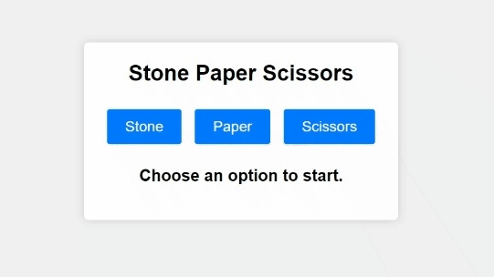

# Stone Paper Scissors Game

This is a simple Stone, Paper, Scissors game implemented in HTML, CSS, and JavaScript.

## How to Play

1. Open `index.html` in a web browser.
2. Click on one of the buttons to make your choice (Stone, Paper, or Scissors).
3. The computer will make a random choice.
4. The result of the game will be displayed on the screen.

## Features

- Classic Stone, Paper, Scissors gameplay.
- Simple and easy-to-understand user interface.
- Random computer choices may be ganerated.
- Instant results displayed on the screen.

## Technologies Used

- HTML
- CSS
- JavaScript

Feel free to modify the code to customize the game or add additional features.
