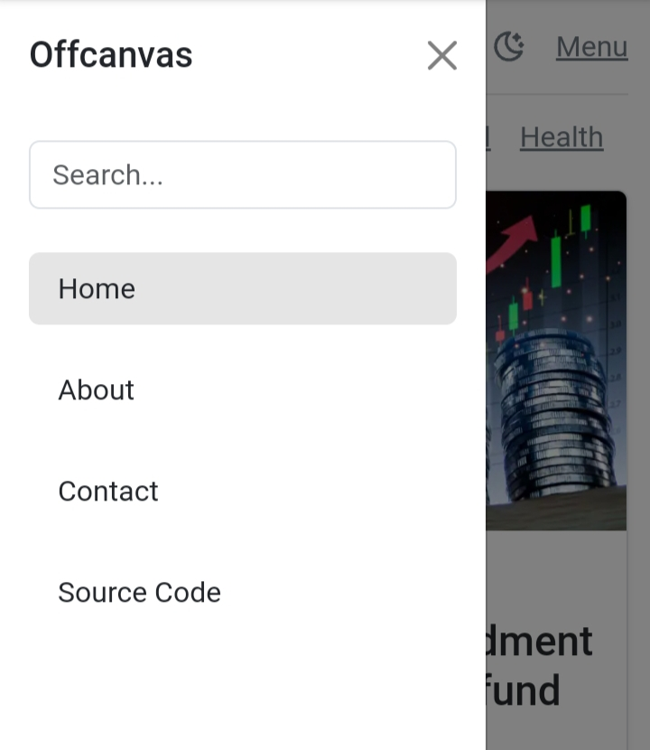

# NewsFinder
Get or search top news headlines delivered from reputed leading news websites


## API Reference
```http
https://newsapi.org/
```

#### Pricing 

```http
https://newsapi.org/pricing
```

## Functions and Variables
| Parameter | Type     | Description                |
| :-------- | :------- | :------------------------- |
| `api` | `string` | **Required**. _ENTER_YOUR_API |

#### getParam(p)

Returns the current parameters of URL.
| Parameter | Type     | Description                |
| :-------- | :------- | :------------------------- |
| `p` | `string` | 'c' for category and 's' for search query  |


#### getData(code, category, search)

Print data came through API
| Parameter | Type     | Description                |
| :-------- | :------- | :------------------------- |
| `code` | `string` | country code for regional based results |
| `category` | `string` | category for news extracted from URL |
| `search` | `string` |  query for searching news |

#### getNews()
Function which handles all of the operations


## Features

- Light/dark mode toggle
- Responsive
- get overview of news
- wider range of categories
- regional based results 


## Screenshots
From Android phone 





## Contributing

Contributions are always welcome!
